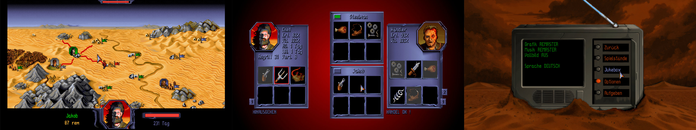

# Burntime

Burntime is a remaster and expansion of Max Design's PC strategy game 'Burntime' from 1993. It includes improvements like doubled resolution and wide screen support.

- Download: [Releases](https://github.com/jakobharder/burntime/releases)
- Recent changes: [Changelog.md](./resources/Changelog.md)
- Issues &amp; requests: [GitHub issues](https://github.com/jakobharder/burntime/issues) or [Burntime.org (German forum)](https://www.burntime.org/forum/viewtopic.php?t=323)
- [Feature Overview](./resources/Features.md)

## Build and Debug

- open `source/Burntime.sln` in Visual Studio
- mark `Burntime.MonoGame` as the start-up project
- build & start

## Credits

This project is not affiliated in any way with Max Design and/or the original creators.
The original game, graphics and other assets are the property of Max Design and their original creators.

A big thanks to Martin Lasser and Hannes Seifert for allowing this community remake effort to use the original graphics and music!

See full [list of contributors](./resources/README.md#notes)
