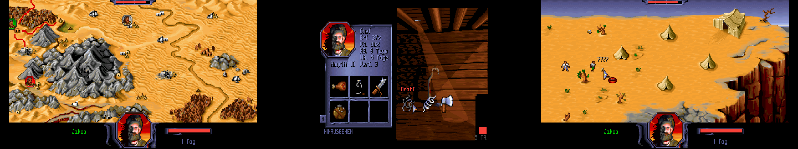

# Burntime

Burntime is a remaster and expansion of Max Design's PC strategy game 'Burntime' from 1993.

## Get the Game

Download it from [Releases](https://github.com/jakobharder/burntime/releases).

## Features

The game is a complete port of the original game to Windows with some adjustments and an extended game mode.

- wide-screen support
- remastered graphics with doubled resolution
- game adjustments
  - toggle to switch between original and extended game
  - toggle to disable AI players
  - attacks are always followed by counter attacks to avoid attack spamming
- UI adjustments
  - attack/defense/protection values displayed in inventory
- minor location adjustments
  - some locations are larger to fill wide screens
  - Monastery got another gap in the wall to go through

### Extended Game

The extended game mode adds new items, locations and gameplay features.
You can disable these changes in the start menu.

- additional items
- clothes provide a small defense boost

## Build and Debug

- Open `source/Burntime.sln` in Visual Studio
- Build solution (it will generate a `bin/burntime` folder)
- Mark `Burntime` as the start-up project
- Start

You can also mark the `Launcher` as start-up project to change settings and debug that part.

## Changes

See [Changelog.md](./resources/Changelog.md)

## Credits

This project is not affiliated in any way with Max Design and/or the original creators.
The original game, graphics and other assets are the property of Max Design and their original creators.

Thank you Martin Lasser for allowing non-commercial community remake efforts to use the original graphics!

See full [list of contributors](./resources/README.md#notes)
