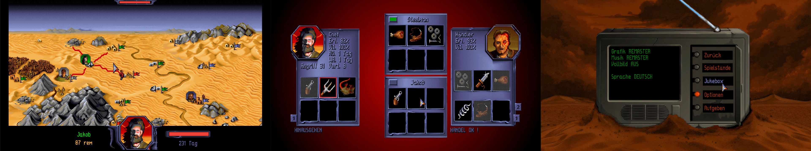

# Burntime

Burntime is a remaster and expansion of Max Design's 1993 strategy game 'Burntime'.
It recreates the original game with remastered graphics and modern platform support, while also adding new and expanded gameplay.



## Features

- Faithful 1993 mode alongside expanded gameplay
- Remastered graphics, widescreen and modern resolutions
- New locations, items and gameplay mechanics
- Reworked AI and difficulty levels
- Mouse, keyboard and gamepad controls
- Native Windows, macOS and Linux support

[Full feature overview](./resources/Features.md)

## How to get

- [Steam](https://store.steampowered.com/app/3269080/Burntime_Remastered/) (Windows & SteamOS Proton)
- [Direct Download](https://github.com/jakobharder/burntime/releases) (Windows, MacOS & Linux)

## Notes

- Recent changes: [Changelog.md](./resources/Changelog.md)
- Issues &amp; requests: [GitHub issues](https://github.com/jakobharder/burntime/issues) or [Burntime.org (German forum)](https://www.burntime.org/forum/viewtopic.php?t=323)

## Development

### Prerequisites

- [Git](https://git-scm.com/downloads) (used in build process to get the version tag)
- [.NET 10 SDK](https://dotnet.microsoft.com/download/dotnet/10.0)
- MonoGame 3.8.5 tools:

```sh
dotnet tool restore --tool-manifest source/Burntime.MonoGame/.config/dotnet-tools.json
```

MonoGame framework packages are restored automatically by .NET.

### Build and run

```sh
dotnet build source/Burntime.MonoGame/Burntime.MonoGame.csproj -c Debug
dotnet run --project source/Burntime.MonoGame/Burntime.MonoGame.csproj
```

The default build omits optional shaders and does not require Wine. To compile
the sharp-bilinear shader as part of the build, use:

```sh
dotnet build source/Burntime.MonoGame/Burntime.MonoGame.csproj -c Debug -p:BuildShaders=true
```

This also deploys the compiled shader to `resources/game/classic/shaders`. Once
generated, normal builds and publishes include it as part of the classic package
without requiring Wine or the shader compiler. In
VS Code, use the `build Burntime with shaders (Debug)` task or the
`Debug Burntime (with shaders)` launch configuration to refresh it.

MonoGame shader compilation on macOS and Linux requires Wine. Once compiled,
the shader remains available to subsequent normal builds through the platform
filesystem.

For windowed Steam feature and resolution testing, pass one of these options after
`--`:

```sh
dotnet run --project source/Burntime.MonoGame/Burntime.MonoGame.csproj -- --steam-machine
dotnet run --project source/Burntime.MonoGame/Burntime.MonoGame.csproj -- --steam-deck
dotnet run --project source/Burntime.MonoGame/Burntime.MonoGame.csproj -- --choose-language
dotnet run --project source/Burntime.MonoGame/Burntime.MonoGame.csproj -- --linear
dotnet run --project source/Burntime.MonoGame/Burntime.MonoGame.csproj -- --fps
```

- `--steam-machine` uses the normal half-display window size, defaults to gamepad
  prompts, and disables the fullscreen toggle.
- `--steam-deck` uses a 1280x800 window with 1.5× output scaling, defaults to
  gamepad prompts, and disables the fullscreen toggle.
- `--choose-language` opens the language selection scene even when a language was
  saved previously. It can be combined with either Steam emulation option.
- `--linear` uses linear filtering when scaling the intermediate render buffer to
  the window. The default is nearest-neighbor filtering.
- `--fps` shows the FPS and used texture memory in the top-left corner.

### Headless AI simulation

Run a deterministic four-AI game without opening a window:

```sh
scripts/ai-simulate.sh --turns 100 --difficulty hard --seed 123 --report ai-run.txt
```

- `--turns`: number of turns; default `100`.
- `--difficulty`: `easy`, `normal`, or `hard`; default `hard`.
- `--seed`: random seed for reproducible runs; default `1`.
- `--report`: optional output file; without it, the report is printed to the terminal.
- `--extended`: optionally use the extended-game item set instead of 1993 rules.
- `--load-save`: start the simulation from an existing `.sav` instead of a new game.
- `--save-at-end`: save the resulting game after the requested turns complete.

The report summarizes player condition, travel, camps, stationed NPCs, and major timeline events.

For example, continue a player save for 25 turns and write a new save:

```sh
scripts/ai-simulate.sh --load-save old.sav --turns 25 --save-at-end continued.sav
```

### Save-game compatibility tests

Place historical save fixtures below `tests/savegames`, grouped by release, and run:

```sh
scripts/savegame-test.sh
```

Every `.sav` is loaded recursively and advanced through at least one complete
turn, including human-controlled player slots. See
[`tests/savegames/README.md`](tests/savegames/README.md) for the fixture layout.

Check that the standard AI baseline has not changed:

```sh
scripts/ai-refactor-check.sh
```

### Publish

```sh
dotnet publish source/Burntime.MonoGame/Burntime.MonoGame.csproj -c Release -r <platform> --self-contained true -p:PublishSingleFile=true
```

Use one of the following instead of `<platform>`:
- `osx-arm64`, `osx-x64`, `linux-x64`, `win-x64`

Visual Studio users: open `source/Burntime.sln` and select `Burntime.MonoGame` as the startup project.

## Credits

Burntime is developed and maintained by Jakob Harder, with contributions from the community.

Burntime is a community project and is not affiliated with Max Design or the original developers of Burntime.
The original game, graphics, music, and other assets were created by Max Design and the original development team.

Special thanks to to Martin Lasser, Wilfried Reiter and Hannes Seifert for allowing
this remaster to use the original graphics and music.

See the full [list of contributors](./resources/README.md#credits).
