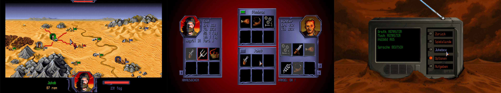

# Burntime

Burntime is a remaster and expansion of Max Design's 1993 strategy game 'Burntime'.
It recreates the original game with remastered graphics and modern platform support, while also adding new and expanded gameplay.



## Features

- Faithful 1993 mode alongside expanded gameplay
- Remastered graphics, widescreen and modern resolutions
- New locations, items and gameplay mechanics
- Reworked AI and difficulty levels
- Mouse, keyboard and gamepad controls
- Native Windows, macOS and Linux support

[Full feature overview](./resources/Features.md)

## How to get

- [Steam](https://store.steampowered.com/app/3269080/Burntime_Remastered/) (Windows & SteamOS Proton)
- [Direct Download](https://github.com/jakobharder/burntime/releases) (Windows, MacOS & Linux)

## Notes

- Recent changes: [Changelog.md](./resources/Changelog.md)
- Issues &amp; requests: [GitHub issues](https://github.com/jakobharder/burntime/issues) or [Burntime.org (German forum)](https://www.burntime.org/forum/viewtopic.php?t=323)

## Development

### Prerequisites

- [Git](https://git-scm.com/downloads) (used in build process to get the version tag)
- [.NET 10 SDK](https://dotnet.microsoft.com/download/dotnet/10.0)
- MonoGame 3.8.5 tools: `dotnet tool restore --tool-manifest source/Burntime.MonoGame/.config/dotnet-tools.json`

### Build and run

Default builds omit optional shader compilation.

```sh
dotnet build source/Burntime.MonoGame/Burntime.MonoGame.csproj -c Debug
dotnet run --project source/Burntime.MonoGame/Burntime.MonoGame.csproj
```

Shader compilation requires Wine on macOS and Linux; generated shaders are reused by normal builds and publishes.

Compile and deploy the sharp-bilinear shader with:

```sh
dotnet build source/Burntime.MonoGame/Burntime.MonoGame.csproj -c Debug -p:BuildShaders=true
```

- [Runtime testing options](doc/command-line.md)
- [Headless AI simulation and test scripts](scripts/README.md)

### Publish

```sh
dotnet publish source/Burntime.MonoGame/Burntime.MonoGame.csproj -c Release -r <platform> --self-contained true -p:PublishSingleFile=true
```

Use one of the following instead of `<platform>`:
- `osx-arm64`, `osx-x64`, `linux-x64`, `win-x64`

## Credits

Burntime is developed and maintained by Jakob Harder, with contributions from the community.

Burntime is a community project and is not affiliated with Max Design or the original developers of Burntime.
The original game, graphics, music, and other assets were created by Max Design and the original development team.

Special thanks to to Martin Lasser, Wilfried Reiter and Hannes Seifert for allowing
this remaster to use the original graphics and music.

See the full [list of contributors](./resources/README.md#credits).
